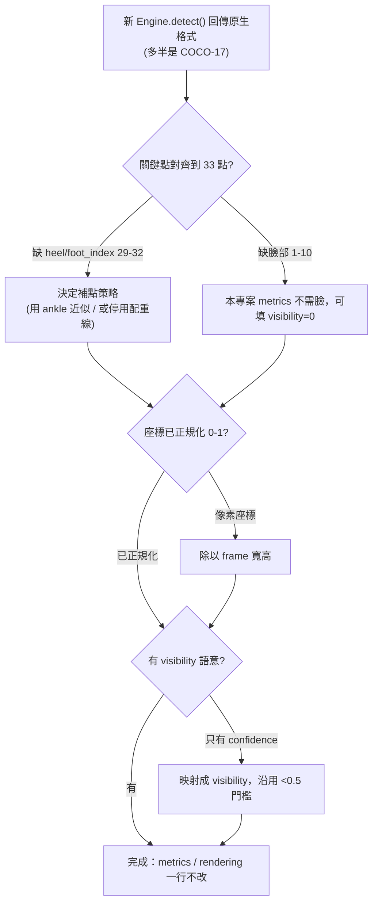

# 現代姿態引擎比較 (Modern Pose Engine Comparison)

> 給 `surfanalysis` 維護者的選型參考。重點不是「哪個 mAP 最高」，而是「哪個能當 `PoseEngine` 的 drop-in，且不破壞既有 `metrics/` 與 `rendering/`」。

## 結論先講 (TL;DR)

- 本專案目前用 `MediaPipe Pose (BlazePose)`，對「單人 + 需要腳部關鍵點 + CPU 即時 + 正規化座標含 visibility」這組需求，仍是最省力的選擇。
- 若要追求更高精度或多人，最務實的升級是 `RTMPose`（精度/速度俱佳、可部署）或 `YOLO11-pose`（單階段、API 最簡）。
- `最大陷阱`：除了 MediaPipe，幾乎所有現代引擎輸出的是 `COCO-17` 骨架，`沒有腳跟 (heel) 與腳尖 (foot_index)`。本專案的`配重線 (foot-to-foot weight line)`與 `CoM` 依賴 landmarks 29–32，換成 COCO-17 會直接讓這些指標失效。換引擎不是只改 `detect()`，而是要先決定如何補足缺失關鍵點。

## 一、現代引擎全景 (Landscape)

數量上「現代、仍在維護、值得認真評估」的 2D 人體姿態引擎大致 `10 個`，可分四類：

```text
姿態引擎 (Pose Engines)
├── 輕量 / 端上即時 (Lightweight / On-device)
│   ├── MediaPipe Pose (BlazePose)   — 33 kpts, +z, +visibility  ← 本專案使用中
│   ├── MoveNet (Lightning / Thunder) — 17 kpts, TF.js / Edge
│   └── PoseNet (legacy)              — 17 kpts, 已被上面取代
├── 單階段多人 (Single-stage, multi-person)
│   ├── YOLOv8-pose / YOLO11-pose     — 17 kpts, Ultralytics
│   └── OpenPose                      — 多人 + 臉/手/腳 (~135 kpts), bottom-up 始祖
├── 兩階段高精度 (Top-down, detector + pose)
│   ├── RTMPose                       — 17 / 全身 133 kpts, 速度精度平衡
│   ├── AlphaPose                     — 全身 136 kpts (Halpe)
│   ├── HRNet                         — 高解析、許多方法的 backbone
│   └── ViTPose / ViTPose++           — Transformer，COCO 精度 SOTA
└── 3D / 網格重建 (3D lifting & mesh, 進階)
    ├── MotionBERT / VideoPose3D      — 2D→3D 抬升
    └── HybrIK / PARE / 4D-Humans     — SMPL 全身網格
```

## 二、逐一比較 (Head-to-head)

關鍵欄位：`輸出格式`決定能否 drop-in；`多人`與`3D`決定能力上限；`速度`是相對量級（同一張中階 GPU / 或標明 CPU）。

| 引擎 | 關鍵點格式 | 多人 | 3D | 相對速度 | COCO val mAP（約略，版本/硬體而異） | 授權 |
| --- | --- | --- | --- | --- | --- | --- |
| `MediaPipe Pose` | 33（含腳/臉，+z, +visibility）| 否（單人）| 偽 3D (GHUM) | 極快（CPU 即時）| 非同套指標，中等 | Apache-2.0 |
| `MoveNet` | 17 (COCO) | 否（單人為主）| 否 | 極快（端上）| ~70 (Thunder) | Apache-2.0 |
| `YOLO11-pose` | 17 (COCO) | 是 | 否 | 快 | ~70–72 (x) | AGPL-3.0 ⚠ |
| `OpenPose` | 18 / +臉手腳 ~135 | 是 | 否 | 慢（吃 GPU）| ~61–65 | 學術免費，商用受限 ⚠ |
| `RTMPose` | 17 / 全身 133 | 是（需偵測器）| 否 | 快（可即時）| ~75–76 (l/x) | Apache-2.0 |
| `AlphaPose` | 全身 136 (Halpe) | 是（需偵測器）| 否 | 中 | ~73–74 | 學術免費，商用受限 ⚠ |
| `HRNet` | 17 | 是（需偵測器）| 否 | 中偏慢 | ~75–77 (W48) | MIT |
| `ViTPose++` | 17 | 是（需偵測器）| 否 | 慢（大模型）| ~79+ (H) | Apache-2.0 |
| `MotionBERT` 等 3D | 17 → 3D | 視前端 | 是 | 慢（離線）| 3D 指標另計 | 視專案 |

> mAP 僅供量級比較，勿當定論：不同 input size、是否多尺度、偵測器品質都會大幅影響數字。MediaPipe 用自有 33 點格式，無法與 COCO-17 直接比 AP。

## 三、各自擅長與不擅長 (Good for / Bad for)

### MediaPipe Pose (BlazePose) — 本專案現用

- 擅長：CPU / 行動端即時；單人；`33 點含腳跟腳尖`與 `visibility`；內建 `VIDEO` 模式做`時序追蹤 (temporal tracking)`，跨短暫漏偵很穩（本專案 sample 偵測率因此從 49.6% → 94.5%）。整合最省力。
- 不擅長：`單人`（畫面多人會挑一個）；遮擋/小而快的主體精度不如兩階段法；COCO mAP 不是它的強項；偽 3D 的 z 軸僅供參考。

### MoveNet

- 擅長：瀏覽器 / 邊緣裝置 (TF.js, Coral) 即時；極輕。
- 不擅長：`17 點、無腳部細節`；以單人為主；精度普通。

### YOLOv8-pose / YOLO11-pose

- 擅長：`單階段端到端`、多人、API 最簡單、生態與工具鏈成熟；速度好。
- 不擅長：`只有 17 點`（無腳跟/腳尖/臉）；高端精度略遜頂級兩階段法；無 3D；`AGPL-3.0`授權對閉源商用是負擔（需商業授權）。

### OpenPose

- 擅長：多人 bottom-up 的經典；提供臉/手/`腳部`關鍵點；場景熱鬧時仍穩。
- 不擅長：重、吃 GPU、現在精度已被超越；商用授權受限；維護趨緩。

### RTMPose

- 擅長：`速度與精度的甜蜜點`，可即時又接近 SOTA；有`全身 133 點`版本（腳/手/臉都涵蓋，對本專案的腳部需求是少數可直接補上的選項）；對部署友善（ONNX / TensorRT / ncnn）。
- 不擅長：`兩階段`，需要先跑人物偵測器，pipeline 較複雜；預設輸出 COCO-17 而非正規化 33 點，需轉換。

### AlphaPose

- 擅長：高精度多人；全身 136 點 (Halpe) 含腳。
- 不擅長：較重、安裝較繁；商用授權需確認。

### HRNet / ViTPose++

- 擅長：`精度天花板`（ViTPose++ 是 COCO 標竿之一）；適合離線、精度優先的研究與標註生成。
- 不擅長：模型大、慢、吃資源；兩階段；對即時/端上不友善。

### 3D / 網格 (MotionBERT, HybrIK, 4D-Humans…)

- 擅長：真正的 3D 關節或 SMPL 全身網格，適合做`真實傾角/旋轉`等 3D 生物力學。
- 不擅長：通常離線、慢、需要好的 2D 前端；對本專案目前的 2D 正規化指標而言過度設計。

## 四、對 `surfanalysis` 的選型建議 (Recommendation)

把專案實際約束（單人衝浪者、側面/正面視角、主體常小而快、要腳部配重、CPU 友善、輸出需正規化 + visibility）映到引擎：

| 你的目標 | 建議引擎 | 為什麼 / 代價 |
| --- | --- | --- |
| 維持現狀、最低成本 | `MediaPipe Pose` | 已滿足單人 + 腳部 + 時序追蹤；先用 `--model-complexity 2 --min-confidence 0.3` 壓榨精度 |
| 想要更高精度、單人 | `RTMPose-l/x (全身 133)` | 精度高且唯一能直接補回腳部關鍵點；代價是兩階段 pipeline + 座標轉換 |
| 海拍多衝浪者 / 多人 | `YOLO11-pose` 或 `RTMPose + 偵測器` | 多人能力；但 17 點缺腳，需補點，且注意 YOLO 的 AGPL 授權 |
| 想做 3D 傾角/旋轉 | `RTMPose/ViTPose → MotionBERT` | 2D 前端 + 3D 抬升；屬 Phase 3 等級的工程量 |

### 換引擎的真正檢查清單

策略模式讓「接上」很容易，但「接對」要過這幾關：



核心提醒：本專案所有指標在`必要關鍵點 visibility < 0.5 時回傳 None`，而`配重線與 CoM 用到 landmarks 23–32（含髖、膝、踝、腳跟、腳尖）`。任何 COCO-17 引擎都缺 `29–32`，所以換引擎的第一個決策不是程式碼，而是：`缺的腳部點要怎麼辦`——用腳踝近似、改用全身 133 點模型、還是在側面視角下接受配重線降級。

## 延伸閱讀

- `docs/tutorials/pose-biomechanics-tutorial.md` 6.2 節 — 策略模式換引擎的最小步驟
- `src/surfanalysis/extraction/engine.py` — `PoseEngine` ABC（`detect()` / `info()` 契約）
- `src/surfanalysis/extraction/landmarks.py` — 33 點命名索引（含腳部 29–32）
- MMPose / RTMPose：<https://github.com/open-mmlab/mmpose>
- Ultralytics YOLO-pose：<https://docs.ultralytics.com/tasks/pose/>
- MediaPipe Pose Landmarker：<https://developers.google.com/mediapipe/solutions/vision/pose_landmarker>
