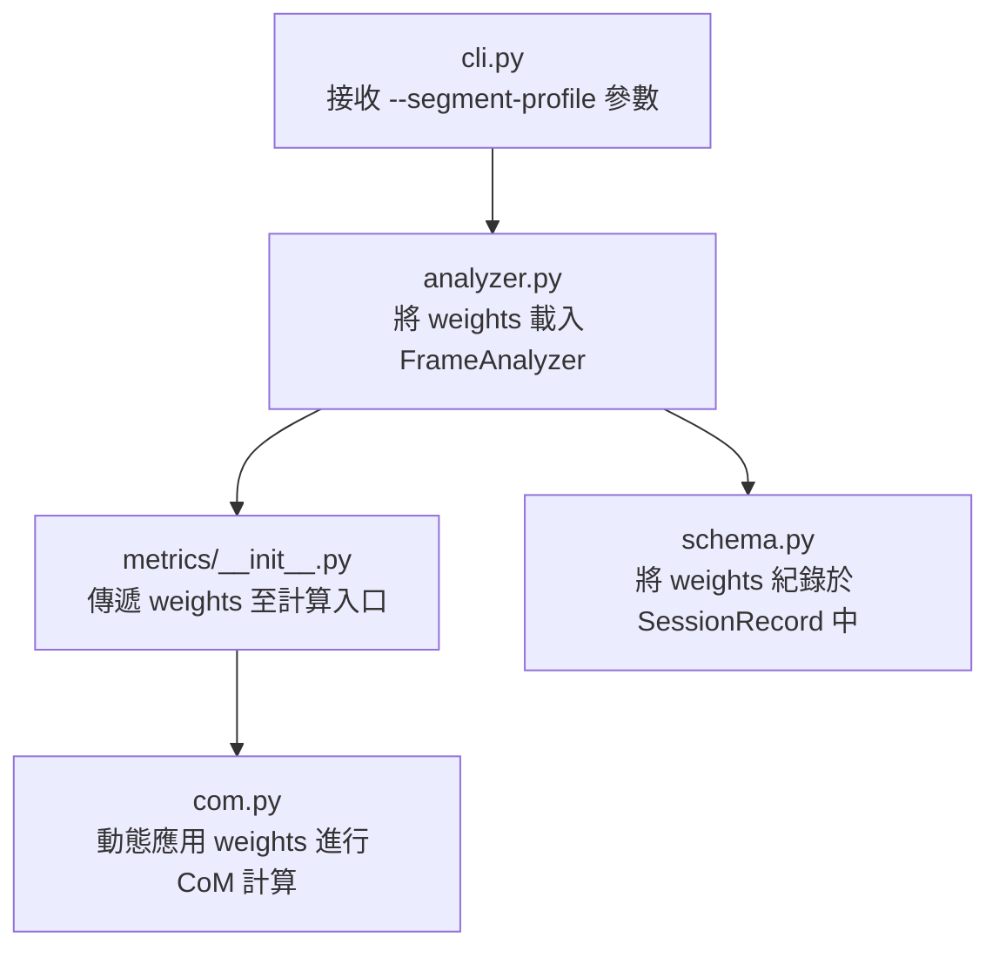

# 衝浪重心與自定義肢段比例指南 (Surfing CoM & Custom Segment Proportions Guide)

在進行衝浪姿態的`生物力學分析 (biomechanics analysis)`時，精確的`重心 (center of mass, CoM)`與`前後腳配重 (weight distribution)`估算是核心指標。本專案預設採用 `Plagenhoef 分段質量法 (Plagenhoef segmental mass approximation)`，但提供自定義`肢段比例 (segment proportion)`的擴充能力，能使分析更貼近不同衝浪者的真實身體物理特性。

---

## 1. 為什麼需要自定義肢段比例？ (Why Custom Proportions?)

預設的 Plagenhoef 係數是基於一般人體解剖學的統計平均值。然而，在衝浪運動中，以下因素會顯著改變人體的表觀質量分佈：

* `防寒衣裝備 (wetsuit gear)`：
  * 穿著厚重的防寒衣（特別是 3mm/4mm 或帶有防寒鞋頭套的冷水裝備）會增加四肢的重量。
  * 防寒衣吸水後，四肢肢段的質量占比會相較於裸體或穿著海灘褲時更高。
* `個體體型差異 (body type variations)`：
  * 衝浪者的性別、年齡（如青少年衝浪者）以及體脂分佈皆不同。例如，上半身發達（胸背較厚）的衝浪者其軀幹質量占比較高；而下半身強壯的衝浪者其大腿與小腿質量占比會高於平均值。
* `相機視角與水阻 (camera perspective & water resistance)`：
  * 當下半身局部浸泡在水中或受白浪沖刷時，水阻與浮力會對重心造成干擾，適度調低受水阻影響肢段的計算權重，能獲得更穩定的重心估算代理量。

---

## 2. 數學原理與動態遮擋補償 (Mathematical Principles & Occlusion)

重心 `CoM` 的計算公式如下：

```text
CoM = Σ(可見肢段中點座標 × 該肢段質量係數) / Σ(可見肢段的質量係數)
```

### 2.1 動態遮擋補償機制 (Dynamic Occlusion Compensation)

在衝浪中，雙腳（特別是前腳與後腳的踝部、腳尖）經常被浪花或板頭遮擋，導致其`可見度 (visibility)`低於預設的門檻值 `VISIBILITY_THRESHOLD = 0.5`。

系統的動態補償機制如下：
* 當某個肢段不可見時（例如左足不可見），該肢段的權重將不參與分母的加總。
* 剩餘可見肢段的權重會自動進行`重新正規化 (re-normalization)`。
* 只要所有可見肢段的質量係數總和小於設好的門檻 `_MIN_PRESENT_MASS = 0.8`，系統就會停止計算並回傳 `None`，以防止資訊不足時產生錯誤偏離。

如果我們能提供更精確的自定義基礎比例，在發生遮擋時，剩餘可見肢段的相對比例分配將會更加精確。

---

## 3. 推薦的肢段比例配置檔 (Recommended Segment Profiles)

以下是針對不同衝浪情境推薦的`肢段比例配置檔 (segment profiles)`：

| 肢段 (Segment) | 標準 (Standard / Plagenhoef) | 濕式防寒衣 (Wetsuit / 3-5mm) | 上半身厚實型 (Trunk-Heavy) | 修長/青少年型 (Slender / Youth) |
| --- | --- | --- | --- | --- |
| `頭 (Head)` | 0.081 | 0.075 | 0.070 | 0.090 |
| `軀幹 (Trunk)` | 0.497 | 0.450 | 0.540 | 0.460 |
| `上臂 ×2 (Upper Arms)` | 0.028 各 | 0.032 各 | 0.030 各 | 0.026 各 |
| `前臂 ×2 (Forearms)` | 0.016 各 | 0.020 各 | 0.018 各 | 0.015 各 |
| `大腿 ×2 (Thighs)` | 0.100 各 | 0.105 各 | 0.090 各 | 0.095 各 |
| `小腿 ×2 (Calves)` | 0.047 各 | 0.055 各 | 0.045 各 | 0.044 各 |
| `足 ×2 (Feet)` | 0.014 各 | 0.023 各 | 0.013 各 | 0.013 各 |
| `係數總和 (Total Sum)` | 0.988 | 0.987 | 0.992 | 0.981 |

* `濕式防寒衣配置 (Wetsuit)`：適度調高了前臂、小腿與足部的權重，以補償防寒衣與防寒鞋吸水後的重量。
* `上半身厚實型配置 (Trunk-Heavy)`：調高了軀幹權重，適合肩膀與胸背發達的衝浪者。
* `修長/青少年型配置 (Slender / Youth)`：調高了頭部比例，並微幅調低四肢與軀幹比例。

---

## 4. 系統實作與擴充指引 (System Implementation Guide)

要在現有的兩階段管線中實作自定義肢段比例，需要對以下模組進行修改：



### 4.1 核心計算修改 `com.py`

修改 [com.py](file:///Users/shuk/projects/surf_analysis/src/surfanalysis/metrics/com.py)，使其接收自定義權重：

```python
# 定義預設的 Plagenhoef 權重
DEFAULT_SEGMENT_WEIGHTS = {
    "head": 0.081,
    "trunk": 0.497,
    "upper_arm": 0.028,
    "forearm": 0.016,
    "thigh": 0.100,
    "calf": 0.047,
    "foot": 0.014,
}

def compute_com(kp: np.ndarray, custom_weights: dict[str, float] | None = None) -> tuple[float, float] | None:
    w = custom_weights or DEFAULT_SEGMENT_WEIGHTS
    
    segments: list[tuple[np.ndarray | None, float]] = [
        (_point_if_visible(kp, NOSE), w["head"]),
        (_trunk_centroid(kp), w["trunk"]),
        (_midpoint_if_both_visible(kp, L_SHOULDER, L_ELBOW), w["upper_arm"]),
        (_midpoint_if_both_visible(kp, R_SHOULDER, R_ELBOW), w["upper_arm"]),
        (_midpoint_if_both_visible(kp, L_ELBOW, L_WRIST), w["forearm"]),
        (_midpoint_if_both_visible(kp, R_ELBOW, R_WRIST), w["forearm"]),
        (_midpoint_if_both_visible(kp, L_HIP, L_KNEE), w["thigh"]),
        (_midpoint_if_both_visible(kp, R_HIP, R_KNEE), w["thigh"]),
        (_midpoint_if_both_visible(kp, L_KNEE, L_ANKLE), w["calf"]),
        (_midpoint_if_both_visible(kp, R_KNEE, R_ANKLE), w["calf"]),
        (_midpoint_if_both_visible(kp, L_ANKLE, L_FOOT), w["foot"]),
        (_midpoint_if_both_visible(kp, R_ANKLE, R_FOOT), w["foot"]),
    ]
    
    total_mass = 0.0
    weighted = np.zeros(2, dtype=np.float64)
    for pos, weight in segments:
        if pos is None:
            continue
        weighted += pos * weight
        total_mass += weight

    if total_mass < _MIN_PRESENT_MASS:
        return None
    com = weighted / total_mass
    return float(com[0]), float(com[1])
```

### 4.2 資料契約擴充 `schema.py`

為了確保在 `render` 階段能夠精確還原或追溯重心計算所使用的參數，應在 [schema.py](file:///Users/shuk/projects/surf_analysis/src/surfanalysis/extraction/schema.py) 的 `EngineInfo` 或 `SessionRecord` 中新增 `segment_weights` 欄位：

```python
class SessionRecord(BaseModel):
    schema_version: str = "1.0"
    source: SourceInfo
    engine: EngineInfo
    stance: Stance
    segment_profile: str = "standard"  # 紀錄使用的配置檔名稱
    segment_weights: dict[str, float]  # 紀錄實際使用的權重數值
    frames: list[FrameRecord]
    summary: SessionSummary
```

### 4.3 命令列介面擴充 `cli.py`

在 [cli.py](file:///Users/shuk/projects/surf_analysis/src/surfanalysis/cli.py) 的 `extract` 子命令中，新增參數以利使用者調用：

```python
parser.add_argument(
    "--segment-profile",
    choices=["standard", "wetsuit", "trunk-heavy", "slender"],
    default="standard",
    help="人體肢段質量比例配置檔名稱",
)
parser.add_argument(
    "--segment-weights-json",
    type=str,
    default=None,
    help="自定義肢段質量的 JSON 字串，例如 '{\"head\":0.08, \"trunk\":0.50, ...}'",
)
```

如此一來，使用者便能透過以下指令，針對穿著防寒衣的衝浪影片進行高精度的重心分析：

```bash
surf extract clip.MOV --stance regular --segment-profile wetsuit
```
