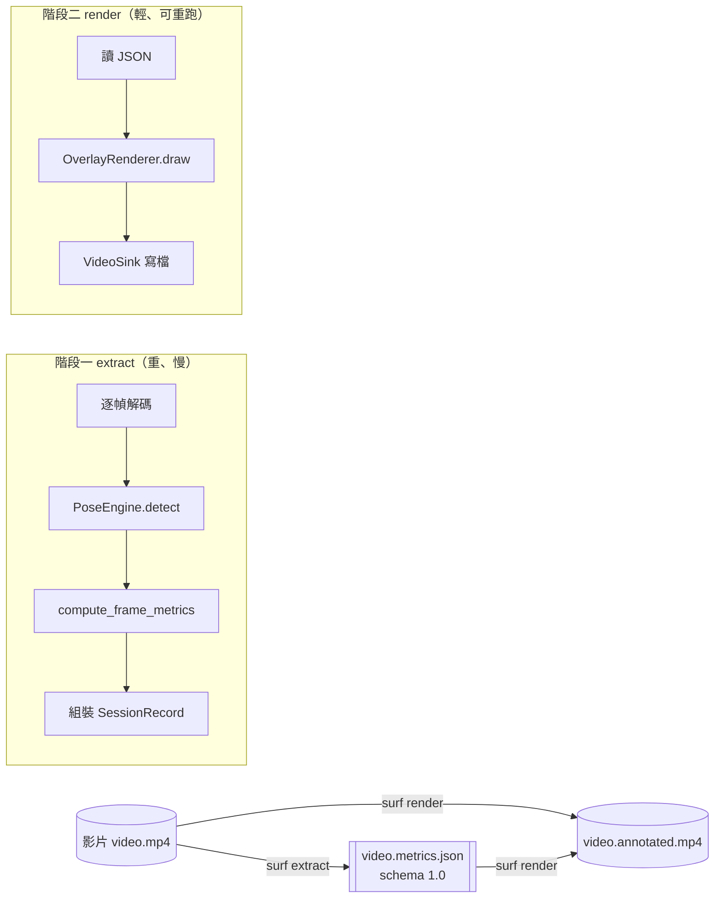
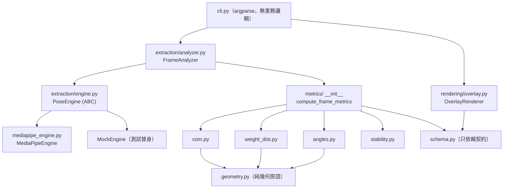
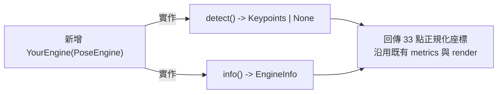

# 衝浪姿態與生物力學分析教學 (surfanalysis Pose & Biomechanics Tutorial)

## 這份文件涵蓋什麼 (TL;DR)

一句話：`surfanalysis` 把一段衝浪影片，先用 `姿態估計 (Pose Estimation)` 抽出每一幀的人體骨架，再用純函式算出 `重心 (Center of Mass, CoM)`、`前後腳配重 (Weight Distribution)`、`關節角度 (Joint Angles)` 等生物力學指標，最後把這些數字疊回影片上。

本教學依「先觀念、再運作、後調校」順序，分為六節：

| 節次 | 主題                                  | 你會學到                               |
| ---- | ------------------------------------- | -------------------------------------- |
| 1    | 背景知識 (Background)                 | 姿態估計、33 關鍵點、`visibility` 門檻 |
| 2    | 系統如何運作 (How It Works)           | 兩階段管線、JSON 契約、模組關係        |
| 3    | 指標數學原理 (The Metrics)            | CoM、配重、角度、穩定度的公式          |
| 4    | 疊圖呈現 (Overlay)                    | render 畫了什麼、怎麼讀                |
| 5    | 如何調校 (Tuning)                     | 各參數作用、常見情境配方               |
| 6    | 解讀與擴充 (Interpreting & Extending) | 真實樣本陷阱、換 Engine                |

> 對應原始碼：`src/surfanalysis/` 之下 `extraction/`、`metrics/`、`rendering/`、`cli.py`。本文所有公式與門檻皆直接引自程式碼，非泛論。

---

## 1. 背景知識 (Background)

### 1.1 姿態估計 (Pose Estimation)

`姿態估計` 是電腦視覺任務：輸入一張影像，輸出人體關節（關鍵點）在影像中的位置。本專案使用 Google 的 `MediaPipe Pose`，它為單一人體輸出 `33` 個關鍵點。

- 模型：`MediaPipe PoseLandmarker`（Tasks API，`running_mode=IMAGE`、`num_poses=1`，逐幀獨立偵測）。
- 模型檔：由環境變數 `MEDIAPIPE_MODEL_PATH` 指定，預設 `~/.mediapipe/pose_landmarker.task`。
- 程式進入點：`extraction/mediapipe_engine.py` 的 `MediaPipeEngine.detect()`。

### 1.2 33 個關鍵點與座標系 (33 Keypoints & Coordinates)

每個關鍵點是一組 `(x, y, z, visibility)`：

- `x, y`：影像內的 `正規化座標 (normalized 0-1)`。`x=0` 是最左、`x=1` 是最右；`y=0` 是最上、`y=1` 是最下。乘上影像寬高即得像素座標。
- `z`：相對深度（本專案的指標計算目前不使用，只存於關鍵點）。
- `visibility`：模型對「這個點可見且可信」的信心 (0-1)。

關鍵點的命名索引集中在一個檔案，避免魔術數字 (magic number)：`extraction/landmarks.py`。重要索引：

```text
肩 L/R = 11/12    肘 L/R = 13/14    腕 L/R = 15/16
髖 L/R = 23/24    膝 L/R = 25/26    踝 L/R = 27/28
腳尖 (foot_index) L/R = 31/32
```

> 為什麼座標用正規化而非像素？因為這樣指標計算與影像解析度脫鉤——同一段動作在 720p 或 1080p 算出來的角度、配重一致。像素轉換只發生在最後 `render` 疊圖時（`overlay.py` 才乘上 `w, h`）。

### 1.3 可見度門檻 (Visibility Threshold) — 整個系統的骨架規則

`landmarks.py` 定義 `VISIBILITY_THRESHOLD = 0.5`。這條規則貫穿所有層：

- 計算某指標所需的任一關鍵點 `visibility < 0.5` → 該指標回傳 `None`。
- 整幀偵測不到人 → 該幀 `keypoints` 與 `metrics` 皆為 `None`。
- 疊圖時 `visibility < 0.5` 的骨架邊與標註不畫。

換句話說，`None` 不是錯誤，而是「資料不足、誠實不猜」的設計選擇。讀結果時把 `None` 當成「這一幀此指標不可信」。

---

## 2. 系統如何運作 (How It Works)

### 2.1 兩階段管線 (Two-Stage Pipeline)

專案刻意把「抽取」與「呈現」拆成兩個 CLI 子指令，中間以一份 JSON 解耦：



為什麼拆兩段？

- `extract` 跑神經網路推論，是整個流程最貴的一步；算一次就好。
- `render` 只是把已算好的數字畫上去。改顏色、改字級、開關次要指標都只需重跑 `render`，不必再推論一次。
- 兩段之間是純資料契約 (`schema_version = "1.0"`)，未來換推論引擎、換繪圖工具都不影響對方。

### 2.2 JSON 契約 (The Data Contract)

由 `extraction/schema.py` 的 Pydantic v2 模型定義，頂層是 `SessionRecord`：

```text
SessionRecord
├── schema_version  "1.0"
├── source          SourceInfo（路徑、寬高、fps、總幀數、時長）
├── engine          EngineInfo（name / version / params）
├── stance          "regular" | "goofy"
├── frames[]        FrameRecord
│   ├── frame_index, timestamp_ms
│   ├── keypoints   Keypoints（33 點，含驗證器強制剛好 33）| None
│   └── metrics     FrameMetrics（見第 3 節）| None
└── summary         SessionSummary
    ├── frames_with_detection / frames_total / detection_rate
    └── metrics_aggregate（com_x/com_y/膝角/配重 的 mean 與 std）
```

`render` 在開頭會驗證 `schema_version == "1.0"`，不符就以 `EXIT_SCHEMA` 退出——這保證未來契約升版不會悄悄畫錯。

### 2.3 模組關係 (Module Map)



設計原則（與 `CLAUDE.md` 一致）：

- `metrics/` 是純函式、無 I/O、`mypy --strict` 必過；只進 numpy 陣列、出數字。
- `rendering/` 只依賴 schema，不認得 MediaPipe。
- `extraction/` 用 `策略模式 (Strategy Pattern)` 把推論引擎抽象成 `PoseEngine`，未來換 RTMPose / YOLO-pose 只要新增一個子類。

> 串接點在 `analyzer.py`：它逐幀呼叫 `engine.detect()`，把回傳的 `Keypoints` 轉成 `(33, 4)` 的 numpy 陣列 (`_kp_to_array`)，再交給 `compute_frame_metrics()`。一個 `StabilityWindow` 物件在整段影片中被重複利用，以維持跨幀的滑動視窗狀態（見 3.5）。

---

## 3. 指標數學原理 (The Metrics)

所有指標的入口是 `metrics/__init__.py` 的 `compute_frame_metrics(kp, stance, stability_window)`。它有一條短路 (short-circuit)：若 `CoM` 算不出來或配重算不出來，整幀 `metrics` 直接回 `None`（並把 `None` 推進穩定度視窗）。也就是說 `CoM` 與配重是「必要指標」，角度類是「有就附上」。

### 3.1 重心 (Center of Mass, CoM)

採 `Plagenhoef 分段質量法 (segmental mass approximation)`：把身體拆成數個肢段，每段以其兩端關鍵點的中點當質心，依人體質量占比加權平均。實作在 `metrics/com.py`。

各段質量係數（直接取自原始碼）：

| 肢段 (Segment) | 取點方式    | 質量係數 |
| -------------- | ----------- | -------- |
| 頭 (以鼻代表)  | NOSE        | 0.081    |
| 軀幹 (Trunk)   | 肩+髖質心   | 0.497    |
| 上臂 ×2        | 肩-肘中點   | 0.028 各 |
| 前臂 ×2        | 肘-腕中點   | 0.016 各 |
| 大腿 ×2        | 髖-膝中點   | 0.100 各 |
| 小腿 ×2        | 膝-踝中點   | 0.047 各 |
| 足 ×2          | 踝-腳尖中點 | 0.014 各 |

公式：

```text
CoM = Σ(可見肢段中點 × 質量係數) / Σ(可見肢段的質量係數)
```

兩個關鍵設計：

- 除以「實際出現的質量總和」而非固定 1.0——所以即使某些肢段被浪花遮住，CoM 仍能用剩下的肢段估出合理值。
- 但設了下限 `_MIN_PRESENT_MASS = 0.8`：若可見肢段加起來不到全身質量的 8 成，回 `None`（資訊太少不硬算）。
- 軀幹質心 (`_trunk_centroid`) 需要肩、髖四點中至少 `3` 點可見才成立；軀幹占 0.497 是最重的一段，缺它幾乎必然觸發下限而回 `None`。

> 全部係數加總約為 `0.988`（非 1.0）——因為頭只用鼻近似、手掌等末端被省略。這對「位置」估計無妨，因為最後是用「出現質量」正規化。

### 3.2 前後腳配重 (Weight Distribution)

實作在 `metrics/weight_dist.py`。直覺：把重心「投影」到兩隻腳連成的線上，看它偏前腳還是後腳。

```text
t = 投影(CoM 落在 後腳→前腳 線段上的比例)，夾在 [0, 1]
weight_dist_front_pct = t × 100
```

- `t=0` 表示重心壓在後腳、`t=1` 壓在前腳。
- 哪隻是前腳由 `stance` 決定：`regular` → 左腳在前；`goofy` → 右腳在前。腳的關鍵點用腳尖 (`foot_index`, 31/32)。
- 投影由 `geometry.py` 的 `project_onto_segment` 完成（向量內積 / 線段長度平方），並 `clamp` 到 `[0,1]` 避免重心落在腳掌延長線外時爆表。

> 重要前提：這是把 `2D 影像重心` 投影到 `2D 影像腳線`，是「配重的代理量 (proxy)」，不是測力板的真實受力。它對「重心往前/往後移動的趨勢」很敏感、可靠；對絕對百分比要保守解讀。攝影機角度越接近正側面 (side-on)，這個近似越準。

### 3.3 關節與軀幹角度 (Joint & Trunk Angles)

幾何原語在 `geometry.py` 的 `angle_at_vertex(a, b, c)`：以 `b` 為頂點，回傳向量 `b→a` 與 `b→c` 的夾角（用內積取 `acos`，並把 `cos` 夾到 `[-1,1]` 防浮點越界）。

| 指標                 | 三點 (a, b, c) | 含義                  |
| -------------------- | -------------- | --------------------- |
| 膝角 `knee_angle_*`  | 髖-膝-踝       | 180° 近伸直、越小越蹲 |
| 肘角 `elbow_angle_*` | 肩-肘-腕       | 手臂彎曲程度          |

軀幹前傾 `torso_lean_deg`（`compute_torso_lean`）算法不同——它是「軀幹向量相對影像鉛直向上」的角度：

```text
trunk = mid_shoulder - mid_hip
torso_lean_deg = atan2(trunk_x, -trunk_y)（轉度）
```

- 站直挺立 ≈ `0°`；上半身往影像右側倒 → 正值；往左 → 負值。
- 解讀陷阱：趴板划水時肩膀在影像中可能低於髖部，`trunk_y` 反向，數值會接近 `±180°`（本專案樣本就有一幀 `159.5°`，正是趴姿）。看到接近 `±180` 的 lean，多半代表「人不是站姿」而非真的傾斜，需配合骨架判讀。

### 3.4 肩髖旋轉 (Shoulder-Hip Rotation / X-factor)

`compute_shoulder_hip_diff`：分別算「肩連線角度」與「髖連線角度」，相減後用 `wrap_to_180` 收斂到 `±180`。它是上下半身 `扭轉分離 (torsional separation)` 的代理量，高爾夫稱 X-factor，衝浪用於看轉身蓄力。屬次要指標，預設不顯示。

### 3.5 重心穩定度 (CoM Stability Score)

實作在 `metrics/stability.py` 的 `StabilityWindow`，是唯一有「跨幀記憶」的指標：

```text
維護最近 size=15 幀的 CoM 滑動視窗
若有效樣本 < 10 → 回 None（視窗還沒填滿）
var = Var(CoM_x) + Var(CoM_y)        # 視窗內重心抖動
score = 1 / (1 + alpha × var)，alpha = 100
```

- 分數落在 `(0, 1]`：`1.0` = 重心幾乎不動（最穩）；越抖越趨近 0。
- 影片開頭前幾幀必為 `None`（樣本不足）；遇到連續偵測失敗也會把 `None` 推進視窗、拉長回穩時間。

### 3.6 缺值語義速查 (None Semantics)

| 情境                   | 結果                                 |
| ---------------------- | ------------------------------------ |
| 整幀偵測不到人         | `keypoints = None`、`metrics = None` |
| CoM 或配重算不出       | 整個 `metrics = None`（短路）        |
| 單一角度所需點不可見   | 該角度欄位 `= None`，其餘照常        |
| 穩定度視窗未滿 10 樣本 | `com_stability_score = None`         |

---

## 4. 疊圖呈現 (Overlay)

`render` 由 `rendering/overlay.py` 的 `OverlayRenderer.draw()` 逐幀繪製。`keypoints` 或 `metrics` 為 `None` 的幀直接原樣輸出（不畫）。畫的內容：

- 骨架 (skeleton)：`skeleton.py` 的 `SKELETON_EDGES` 定義哪些點相連；`visibility < 0.5` 的邊不畫。
- 重心標記：黃色實心圓（含黑邊提升對比）。
- 軀幹傾角線：髖中點 → 肩中點的實線（向上延伸 1.25 倍便於閱讀），旁邊一條灰色虛線鉛直參考線，標 `+X.X deg`。
- 配重基線：後腳 → 前腳的線，線上一個投影點標出重心落點，兩端標 `F xx%` / `B xx%`。
- 左上文字塊：主要指標（前後配重、lean、左右膝角）；加 `--show-secondary` 才顯示肘角、肩髖旋轉、穩定度。

實作小技巧：所有文字先畫黑色粗描邊、再畫彩色細字 (`_text`)，確保在任何背景（白浪、深海）都讀得到；顏色參數以 `#RRGGBB` 傳入，內部 `hex_to_bgr` 轉成 OpenCV 的 BGR。

---

## 5. 如何調校 (Tuning)

### 5.1 extract 階段參數

| 參數                 | 預設      | 作用                                            | 何時調                             |
| -------------------- | --------- | ----------------------------------------------- | ---------------------------------- |
| `--stance`           | `regular` | 決定前後腳對應（影響配重正負）                  | 衝浪者右腳在前時設 `goofy`         |
| `--min-confidence`   | `0.5`     | 偵測信心門檻；調低 → 更願意輸出（含較弱的偵測） | 小目標 / 遠景 / 浪花多時調到 `0.3` |
| `--model-complexity` | `1`       | 記錄於 `engine.params`（見下方註記）            | 配合更重的模型檔                   |
| `--max-frames`       | 無        | 只處理前 N 幀                                   | 快速試跑、調參時省時               |
| `--quiet`            | 關        | 關閉進度條與資訊輸出                            | 批次 / 腳本化                      |

> 重要且常被誤解的一點：本專案用的是新版 `PoseLandmarker` Tasks API，真正接進推論的是 `min_pose_detection_confidence`（即 `--min-confidence`）與 `min_tracking_confidence`。`--model-complexity` 目前僅被寫入 `engine.params` 作為溯源紀錄，並未直接改變推論——實際的 lite / full / heavy 是由 `MEDIAPIPE_MODEL_PATH` 指向的 `.task` 模型檔決定。要真的換成更重、更準的模型，請把環境變數指到 heavy 版模型檔，再搭配 `--min-confidence 0.3`。

### 5.2 render 階段參數

| 參數                  | 預設   | 作用                                        |
| --------------------- | ------ | ------------------------------------------- |
| `--show-secondary`    | 關     | 顯示肘角、肩髖旋轉、穩定度                  |
| `--codec`             | `mp4v` | 編碼；相容性高選 `mp4v`，要 H.264 選 `avc1` |
| `--font-scale`        | `0.6`  | 文字大小（高解析影片可調大）                |
| `--skeleton-color` 等 | 見下   | 各疊圖顏色，`#RRGGBB`                       |

顏色預設：骨架 `#00FF00`、重心 `#FFFF00`、傾角 `#FF40FF`、配重 `#FFA500`。改顏色不需重跑 extract。

### 5.3 常見情境配方 (Recipes)

```bash
# 一般正側面、清晰主體（站姿讀數最準）
surf extract clip.MOV --stance regular
surf render clip.MOV clip.metrics.json --show-secondary

# 小目標 / 遠景 / 浪花多（提高偵測率）—— 先換 heavy 模型檔再降門檻
export MEDIAPIPE_MODEL_PATH=~/.mediapipe/pose_landmarker_heavy.task
surf extract clip.MOV --model-complexity 2 --min-confidence 0.3

# 右腳在前
surf extract clip.MOV --stance goofy

# 調參快速試跑（只跑前 150 幀）
surf extract clip.MOV --max-frames 150 --quiet
```

> 執行注意（環境怪癖）：若 `.venv` 目錄被改過名導致 `surf` 進入點失效，改用模組形式呼叫最穩：`.venv/bin/python -m surfanalysis.cli extract clip.MOV ...`。

### 5.4 調校心法

- 先看 `summary.detection_rate`。偏低（例如本專案樣本只有 ~0.50）代表偵測本身就弱，先從「換重模型 + 降 min-confidence + 讓主體在畫面中更大」著手，再談指標。
- 構圖盡量正側面：配重投影與傾角在側面視角最可信。
- 確認 `stance` 正確，否則前後腳配重會整段相反。
- `render` 是免費的迭代迴圈：顏色、字級、是否顯示次要指標，反覆重跑即可，不必重新 extract。

---

## 6. 解讀與擴充 (Interpreting & Extending)

### 6.1 從真實樣本學解讀

`sample/sample.json`（`engine.params` 為 `complexity=2, min_conf=0.3`）的實況：

| 觀察                       | 數值     | 怎麼讀                                    |
| -------------------------- | -------- | ----------------------------------------- |
| `detection_rate`           | `0.496`  | 約半數幀偵測失敗——衝浪素材的常態，非 bug  |
| 某幀 `torso_lean_deg`      | `159.5°` | 接近 ±180 → 趴板划水，不是「傾斜 159 度」 |
| 該幀 `com_stability_score` | `null`   | 視窗未滿 10 有效樣本                      |
| 該幀 `elbow_angle_*`       | `null`   | 手腕/手肘被遮，可見度不足                 |

核心心智模型：`None` / 偵測失敗是訊號而非雜訊；它告訴你「這段畫面對這個指標不可信」，正確反應是改善構圖或參數，而非無視。

### 6.2 擴充：換一個姿態引擎

得益於策略模式，要接 RTMPose / YOLO-pose，只需：



只要你的 `detect()` 回傳同樣的 `Keypoints`（33 點、正規化、含 visibility），`metrics/` 與 `rendering/` 一行都不用改。測試時可用 `engine.py` 內建的 `MockEngine` 餵入固定序列驗證管線。

### 6.3 延伸閱讀

- `CLAUDE.md` — 專案結構與技術決策
- `plans/video_format_decision.md` — 影片格式 (Container / Codec) 決策指南
- `plans/2026-05-26-surfing-analysis-design.md` — 完整設計規格
- MediaPipe Pose 官方文件：<https://developers.google.com/mediapipe/solutions/vision/pose_landmarker>
